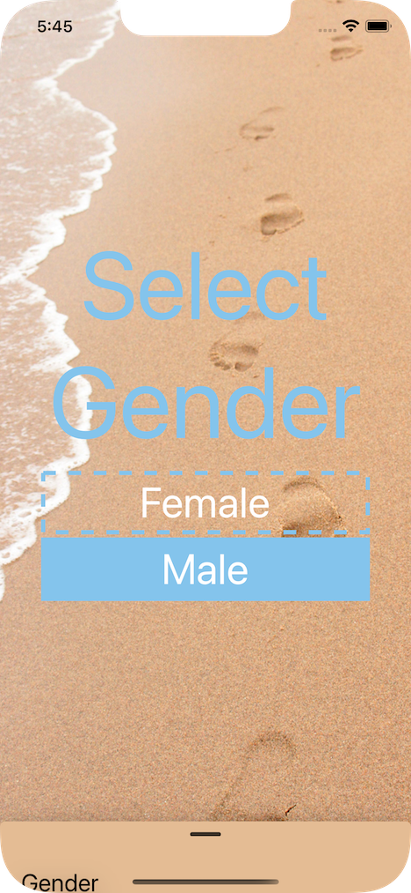
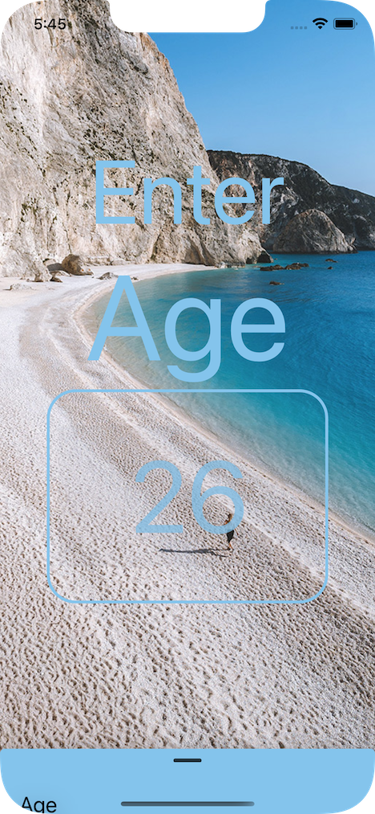
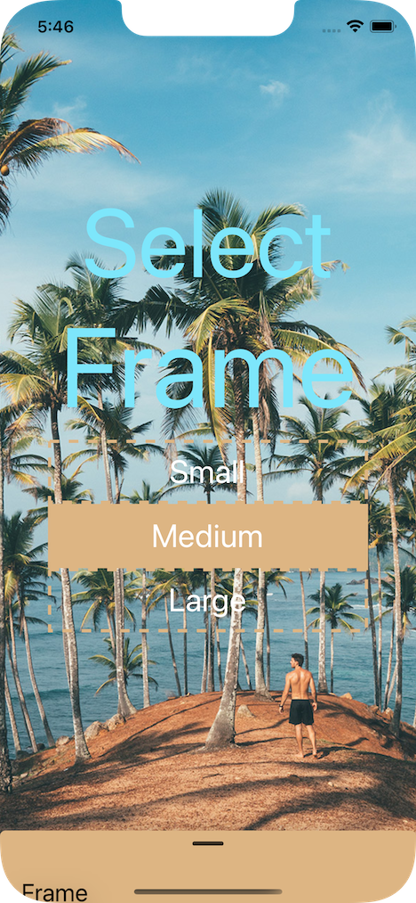
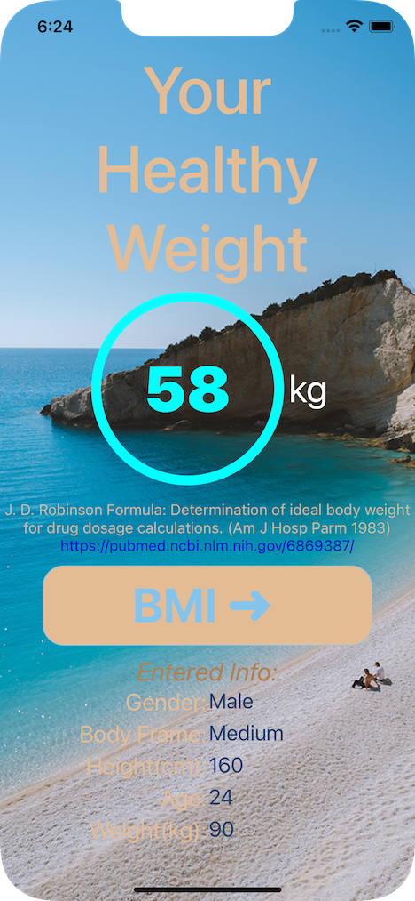

# Healthy Weight Calculator 

## Architecture

## Video

### Select Units:

https://user-images.githubusercontent.com/43282635/235046689-b91705cc-ca14-4b87-a96b-d73e5e7f9485.mp4

### Select Values:

https://user-images.githubusercontent.com/43282635/235046984-cc55f648-1647-4ce9-b8d3-d85dbe2ceb40.mp4

### Use the Help system:

https://user-images.githubusercontent.com/43282635/235047033-bb59db70-0118-471b-91bc-e48eea113f6b.mp4

### Get Results:

https://user-images.githubusercontent.com/43282635/235047051-5239cd6d-5563-4ec3-af9b-a254aa303aa6.mp4

##  Screenshots:

  

### Gender selection:

  

### Age entry:

  

### Body Frame Selection:

  

### Height entry:

  

### Weight entry:

  

### Results page:

  

