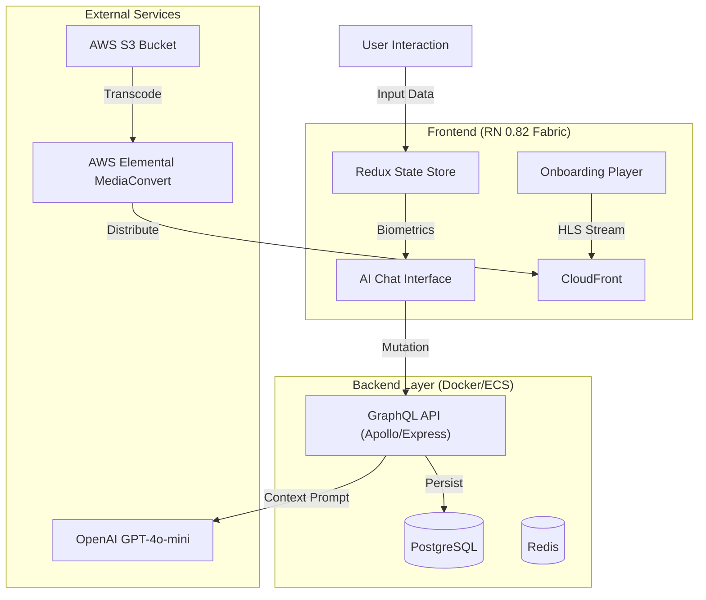

# Healthy AI

# 📱 App Preview

[https://github.com/user-attachments/assets/compressed_healthy_ai_app_preview_github.mp4](https://github.com/user-attachments/assets/77fc6292-b442-4a32-93e9-78a1bbd82998)
  

# 🧬 AI-Powered Health Intelligence
  
Stop chasing arbitrary numbers. Healthy AI combines medical-grade calculations with generative intelligence to provide a personalized roadmap for your health.
*   **🤖 AI Health Consultant:** A context-aware Generative AI agent that analyzes your specific biometrics (Frame, BMI, Age) to provide actionable nutrition and fitness strategies.
*   **⚖️ Medical Precision:** Utilizes the J.D. Robinson Formula (1983) to calculate Ideal Body Weight based on skeletal frame size, offering a more realistic target than standard BMI.
*   **✨ Glassmorphism UI:** A completely modernized, gesture-driven interface built on the React Native New Architecture.

# 🏗️ Technical Architecture

This project represents a modernization of a legacy codebase into a Cloud-Native, AI-driven platform running on **React Native 0.82 (Fabric)**.

*   **Generative AI Pipeline (Context Injection)**
    The "Consultant" feature is not a generic chatbot. The app aggregates Redux state (biometrics, goals, preferences) and injects them into a system prompt sent to a **Node.js/GraphQL** backend. This backend acts as a secure gateway to the **OpenAI API**, returning structured, medically-contextualized advice without exposing API keys to the client.

*   **Global HLS Video Streaming**
    To eliminate the massive bundle size overhead of local video assets, the onboarding experience was re-architected using **AWS MediaConvert**. Source assets are transcoded into adaptive bitrate HLS streams (`.m3u8`) and delivered via **CloudFront**. The frontend utilizes `react-native-video` with a custom "Curtain Lift" state logic to ensure seamless, glitch-free playback start on both iOS and Android.

*   **New Architecture (Fabric & TurboModules)**
    The application was migrated to React Native 0.82 to leverage the JSI (JavaScript Interface). This eliminates the asynchronous bridge, allowing for synchronous UI updates and 60fps animations even during heavy data processing.

|  |  |  |
| :---------------------------------------------: | :---------------------------------------------: | :---------------------------------------------: |
|  |  | |

# System Diagram

# 🛠️ Tech Stack

* **Mobile Framework**: React Native 0.82 (New Architecture Enabled)
* **Language**: TypeScript
* **AI Engine**: OpenAI API (GPT-4o-mini) via Node.js Middleware
* **State Management**: Redux Toolkit
* **API**: GraphQL (Apollo Server / Express)
* **Cloud Infrastructure**: AWS S3, CloudFront, MediaConvert, ECS
* **Database**: PostgreSQL, Redis, Docker
* **UI/UX**: Glassmorphism, Reanimated, SVG Charts

## Main vs design/release project versions

This is the main code project for Healthy Metrics.

You can find its design/release project here:
https://github.com/petemcgowan/healthyMetrics_design_release

 
 
